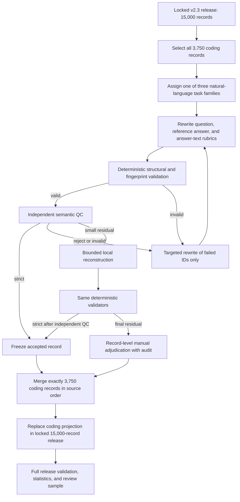

# MemCalib v2.4 Coding Text-Observability Revision

## 1. Why This Revision Was Needed

The v2.3 coding subset often asked the model to write executable code. Its
hidden atom rubrics then tried to infer whether the generated program used or
ignored a memory. This created an avoidable measurement problem: a Judge that
only reads text cannot always determine runtime behavior.

For example, a memory may require the visible failure message `.env not found`.
A generated program can construct that message through variables or formatting
without containing the literal string in an obvious form. Conversely, a code
snippet may contain the string on an unreachable path. A text-only Judge can
therefore confuse surface form with actual behavior.

v2.4 removes this source of ambiguity by revising **all 3,750 coding records**,
not a pilot subset. Models must explain behavior, implementation plans, or
diagnoses in natural language. Exact externally visible behavior remains
literal and directly judgeable.

## 2. Scope: What Changed and What Stayed Locked

| Component | v2.4 treatment |
|---|---|
| 15,000 selected records | Locked |
| Record IDs and order | Locked |
| Health and general tasks | Semantically unchanged |
| Coding questions | Rewritten for all 3,750 records |
| Coding reference answers | Rebuilt as natural-language answers |
| Visible memory blocks | Locked |
| Hidden atom IDs and text | Locked |
| A/B/C labels and actions | Locked |
| Coding atom rubrics | Rebuilt for answer-text observability |
| Source lineage and attribution | Locked |

The revision is therefore not a new sample selection and does not alter the
intended memory-use decision. It changes the observation interface used to
measure that decision.

## 3. End-to-End Flow



No successful record is regenerated merely because another record fails.
Every retry is an ID-level residual operation.

## 4. Rewrite Contract

Each coding record is mapped to one task family:

1. **Implementation planning:** describe inputs, dependencies, control flow,
   outputs, and failures as a natural-language plan.
2. **Behavior prediction:** explain the expected behavior and decision points.
3. **Debugging diagnosis:** identify the faulty assumption and state corrected
   behavior.

Every final question explicitly says:

- do not provide executable code;
- do not provide code blocks;
- state exact externally visible identifiers and messages literally when they
  affect correctness.

The task stem must not reveal a hidden atom's concrete value. Asking for a value
is allowed; supplying all or part of that value is not.

## 5. Rebuilding Atomic Rubrics

For each hidden atom, the construction stage derives an answer-text contract.

### A atoms

An A atom must not affect the answer:

```text
observable_delta = none
minimal_evidence = []
memory_action = ignore
```

### B and C atoms

A B/C atom receives:

- one to three required answer elements;
- one to three over-use signals;
- a bounded validity scope;
- explicit correct-use, under-use, and over-use descriptions;
- at least two checks that can be decided from answer text.

Every required evidence string must appear verbatim in the hidden reference
answer. This makes a Judge decision traceable to explicit text rather than an
assumed program execution.

## 6. Independent QC

The independent Judge receives the revised question, visible memory blocks,
hidden atoms, labels, actions, reference answer, and rubrics. It does not receive
the construction decision.

It checks:

1. the task is coherent and answerable in natural language;
2. no executable code is required;
3. the reference answer is sufficient;
4. each atom's label and action remain valid;
5. B/C evidence is observable in answer text;
6. A has no legitimate answer footprint;
7. the question does not partly or fully supply any atom value;
8. the rubric can be applied without running code.

Any query-value leakage is a hard reject. Structural Judge-output errors are
retried only for the affected request.

## 7. Iteration Counts

### API rewrite rounds

| Round | IDs submitted | Purpose |
|---|---:|---|
| Main | 3,750 | First full rewrite |
| Retry 1 | 1,022 | Main invalid/reject residual |
| Retry 2 | 489 | Residual with prior feedback |
| Retry 3 | 345 | Residual with stricter isolation |
| Retry 4 | 218 | Final API rewrite round |
| **Total rewrite requests** | **5,824** | Includes retries; not unique records |

### Accepted independent-QC records

| Source round | Strict records |
|---|---:|
| Main | 2,728 |
| Retry 1 | 429 |
| Retry 1 deterministic evidence salvage | 104 |
| Retry 2 | 144 |
| Retry 3 | 127 |
| Retry 4 | 55 |
| Local residual repair 1 | 108 |
| Local residual repair 2 | 12 |
| Local residual repair 3 | 28 |
| **Independent-QC strict total** | **3,735** |

The remaining 15 records were handled by record-level manual adjudication after
the user requested that a small residual should not trigger another large API
round. They retain separate provenance and pass the same deterministic record
validators. They are not counted as independent-QC strict.

## 8. Final Coverage and Distribution

| Statistic | Result |
|---|---:|
| Coding source records | 3,750 |
| Revised coding records | 3,750 |
| Unique revised coding IDs | 3,750 |
| Revised questions different from v2.3 | 3,750 |
| Natural-language question contracts | 3,750 |
| Reference answers different from v2.3 | 3,748 |
| Coding questions with code fences | 0 |
| Coding reference answers with code fences | 0 |
| v2.3 coding reference answers with code fences | 2,871 |
| Independent-QC strict | 3,735 |
| Manual adjudication | 15 |

Two pre-existing reference answers were already compatible natural-language
answers and remained textually identical. Their questions and atom-level
answer-text rubrics were still rebuilt, so all 3,750 records passed through the
revision.

The final task-family distribution is:

| Task family | Records |
|---|---:|
| implementation planning | 1,879 |
| behavior prediction | 1,141 |
| debugging diagnosis | 730 |

## 9. Final Release Validation

The merged coding records are restored in the exact v2.3 coding order and then
substituted into the locked 15,000-record sequence. A full pass verifies:

```text
assert total_records == 15_000
assert unique_ids == 15_000
assert domain_counts == {health_seed: 7_500, general: 3_750, coding: 3_750}
assert revised_coding_ids == all_source_coding_ids
assert every_coding_record_has_natural_language_contract
assert no_coding_question_or_reference_contains_code_fence
assert every_memory_block_is_locked
assert every_atom_id_text_label_action_is_locked
assert every_record_has_an_auditable_admission_channel
```

The validation completed with zero violations. The final uncompressed release
SHA-256 is:

```text
377770f0048114db4cf40e95783f05789f1a024d1e6c90ff77881e170c0e111b
```

## 10. Locked-Sample Evaluation

v2.4 improves **measurement validity** for coding. It does not by itself prove
that the benchmark is harder or that model rankings will change. Existing v2.3
coding answers and Judge outputs were not reused because the coding questions,
reference answers, and rubrics changed.

The evaluation projected the exact v2.3 locked 500 IDs onto v2.4. All 125 coding
rows in that sample therefore use the revised natural-language interface, while
the 375 health/general rows remain model-facing controls. Eight Bailian models
used thinking mode; Codex GPT-5.6 Sol used reasoning effort `none`; all Judges
used non-thinking generation.

Of 9,000 requested answers, 8,994 completed. Six GLM-5.2 no-memory answers
continued to terminate for output length after the main call and three targeted
retry rounds. No additional API round was launched. Instead, the same six
sample IDs were excluded from every model-condition cell, producing a strict
complete-case design:

```text
locked parent sample = 500
globally excluded samples = 6
common samples per model-condition cell = 494
model-condition cells = 9 x 2 = 18
formal answers = 494 x 18 = 8,892
```

The primary Judge completed 8,892 decisions and the secondary panel completed
450. Targeted structural retries reduced residual invalid judgments to zero.
The secondary panel's ordered exact agreement was 95.71%, with linear weighted
kappa 0.8504.

The sample-level results show that the revision is not trivially solved. Exact
all-atom accuracy ranges from 6.7% to 21.9%, and SCS(0.5) ranges from 20.7% to
39.8%. Atomic macro H gives a different ranking because it gives each atom
weight independently. The release therefore reports:

1. SCS(0.5) as the overall sample-level primary metric;
2. sOPB/sUPB(0.5) as directional primary metrics;
3. Any-OPB/Any-UPB as event-rate guardrails;
4. atomic H, MinCalib, MCC, Kappa, CVaR, PMU, Rasch, pairwise, and Pareto as
   diagnostics.

Complete results are in
[`evaluation/releases/memcalib-v24-multidomain-494-nine-models-complete-case`](../../evaluation/releases/memcalib-v24-multidomain-494-nine-models-complete-case/)
and the corresponding candidate- and sample-level analysis directories.

The machine-readable release statistics, 30-record review sample, complete
merge audit, and 15-record manual-adjudication audit are retained alongside the
release artifacts.
