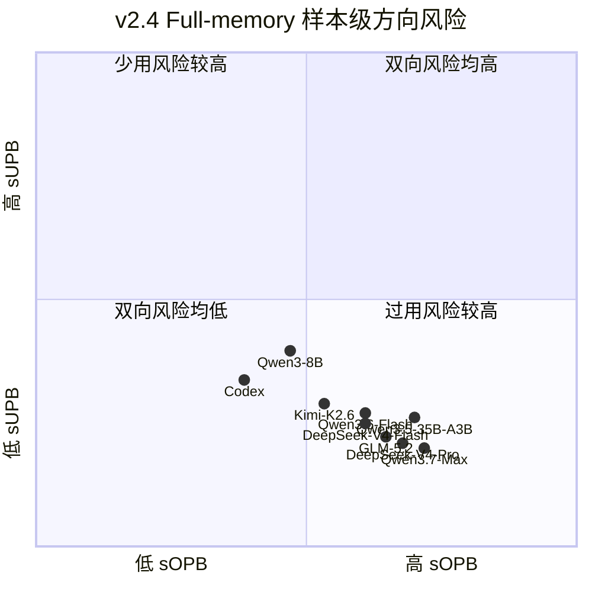

# MemCalib 三层样本级评估：公式、口径与结果汇总

本报告只复用已经完成的主 Judge 输出，不重新调用回答模型或 Judge。当前主结果为
MemCalib v2.4 的九模型完全案例评测；v2.3 Think、Non-Think 与 Base/SFT 结果作为
历史对照保留。所有主表均以一条回答样本为聚合单位；内部构建用的 A 子类型不进入
公开指标。

## 统一口径

- **总体主指标 SCS(0.5)：** 汇总整条回答的双向有序错误，越高越好。
- **方向主指标 sOPB/sUPB(0.5)：** 分别衡量样本级过用和少用强度，
  越低越好。它们区分一次与多次/严重错误，但每条
  样本的单方向风险上限为 1。
- **事件率护栏 Any-OPB/Any-UPB：** 衡量发生至少一次方向错误的样本比例，
  越低越好。它们只描述错误覆盖面，不能单独作为主指标。
- $O_s$、$U_s$ 是样本内所有可评分原子的有序过用/少用预算；相邻等级错误
  计 1，A/C 跨两级错误计 2。所有模型级值对样本等权。
- 方括号为按样本聚类的 2,000 次 bootstrap 95% 区间。

## 详细计算过程

### 1. 评估单位、索引集合与符号

以下定义对一个固定的回答模型 $m$ 和评测条件 $c$ 分别成立。为避免公式冗长，
后续省略预测值和派生指标上的 $(m,c)$ 上标；例如
$\hat u_{s,i}$ 实际表示 $\hat u^{(m,c)}_{s,i}$。不同模型或条件的指标
均按完全相同的步骤独立计算。

| 符号 | 定义域 / 类型 | 精确定义 |
| --- | --- | --- |
| $m$ | 模型索引 | 当前被评估的回答模型 |
| $c$ | 条件索引 | 当前评测条件，例如 Full-memory、No-memory、Think 或 Non-Think |
| $\mathcal S$ | 有限样本集合 | 固定 $(m,c)$ 后，通过结构校验并进入聚合的回答样本 ID 集合 |
| $s\in\mathcal S$ | 样本索引 | 一条完整回答样本，而不是单个记忆块或原子 |
| $N=\lvert\mathcal S\rvert$ | 正整数 | 当前模型与条件下参与聚合的样本数 |
| $\mathcal B_s$ | 有限集合 | 与样本 $s$ 关联的记忆块集合 |
| $b\in\mathcal B_s$ | 记忆块索引 | 样本 $s$ 中的一个记忆块 |
| $\mathcal A_{s,b}$ | 有限集合 | 块 $b$ 中由隐藏标注给出的原子记忆集合 |
| $j\in\mathcal A_{s,b}$ | 块内原子索引 | 记忆块 $b$ 中的一个原子记忆 |
| $\mathcal I_s$ | 有限索引集合 | 样本 $s$ 中所有可评分原子的展平索引集合；每个 $i=(b,j)$ |
| $\operatorname{scorable}_{s,b,j}$ | $\{0,1\}$ | 主 Judge 的可评分标记；取 1 时该原子进入指标 |
| $K_s=\lvert\mathcal I_s\rvert$ | 正整数 | 样本 $s$ 中可评分原子数 |
| $u^*_{s,i}$ | $\{A,B,C\}$ | 原子 $i$ 的规范（gold）使用等级 |
| $\hat u_{s,i}$ | $\{A,B,C\}$ | 主 Judge 根据模型回答判定的实际使用等级 |
| $\rho$ | $(0,1)$ | 每增加一单位错误预算后保留的分数比例；正式口径固定为 $0.5$ |
| $\mathbf 1[P]$ | $\{0,1\}$ | 命题 $P$ 成立取 1，否则取 0 的指示函数 |

可评分原子的定义域不是模糊的“$i\in s$”，而是：

$$
\begin{aligned}
\mathcal I_s
&=\left\{(b,j):
b\in\mathcal B_s,\;
j\in\mathcal A_{s,b},\;
\operatorname{scorable}_{s,b,j}=1
\right\},\\
K_s&=|\mathcal I_s|\ge 1.
\end{aligned}
$$

因此后文的 $i\in\mathcal I_s$ 是二元索引 $(b,j)$ 的简写：它同时标识
原子所属的记忆块和块内位置。Judge 标为不可评分的原子不属于
$\mathcal I_s$；若某条回答没有任何可评分原子，则该回答是结构无效项，
不能被当作零错误样本。用于模型比较的各桶必须通过覆盖校验并具有相同的
$\mathcal S$，避免因样本集合不同产生伪差异。

### 2. A/B/C 等级语义与数值映射

A/B/C 表示原子记忆对当前回答应产生的影响强度，而不是记忆本身的真假：
A 表示不应留下原子特异性的回答痕迹；B 表示只能形成局部、有限的支持或纠正；
C 表示必须实质性地控制或约束核心结论、计划、优先级或安全边界。
错误、过时或不安全但需要显式纠正的记忆可以是 B 或 C；A 的内部构造子类型
只用于数据开发，不进入公开指标。令 $\mathcal L=\{A,B,C\}$，定义有序映射
$r:\mathcal L\rightarrow\{0,1,2\}$：

$$
r(A)=0,\qquad r(B)=1,\qquad r(C)=2
$$

### 3. 原子级有序方向误差

$$
\begin{aligned}
o_{s,i} &= \max\!\left(r(\hat{u}_{s,i})-r(u^*_{s,i}),\,0\right),\\
u_{s,i} &= \max\!\left(r(u^*_{s,i})-r(\hat{u}_{s,i}),\,0\right).
\end{aligned}
$$

其中 $o_{s,i},u_{s,i}\in\{0,1,2\}$。$o_{s,i}$ 是过用预算，
$u_{s,i}$ 是少用预算。相邻等级错误计 1，A/C 跨两级错误计 2；
由两个 max 项的定义可知，同一个原子不可能同时贡献过用和少用。

| Gold → Predicted | 方向 | 过用预算 | 少用预算 |
| --- | ---: | ---: | ---: |
| A → A | 正确 | 0 | 0 |
| A → B | 过用 | 1 | 0 |
| A → C | 过用 | 2 | 0 |
| B → A | 少用 | 0 | 1 |
| B → B | 正确 | 0 | 0 |
| B → C | 过用 | 1 | 0 |
| C → A | 少用 | 0 | 2 |
| C → B | 少用 | 0 | 1 |
| C → C | 正确 | 0 | 0 |

### 4. 样本级方向预算

将一条回答涉及的所有记忆块和所有可评分原子放回同一个样本内累加：

$$
\begin{aligned}
O_s &= \sum_{i\in\mathcal I_s} o_{s,i},\\
U_s &= \sum_{i\in\mathcal I_s} u_{s,i},\\
T_s &= O_s+U_s.
\end{aligned}
$$

$O_s,U_s,T_s\in\mathbb Z_{\ge0}$，分别是样本 $s$ 的过用、少用和总有序
错误预算。它们先在样本内部跨块累加；记忆块数和原子数不会直接成为模型级
权重，但更多可评分原子会提供更多犯错机会。

### 5. 总体主指标 SCS(0.5)

单样本总体校准分：

$$
\begin{aligned}
\mathrm{SCS}_s(\rho) &= \rho^{O_s+U_s},\\
\mathrm{SCS}(\rho) &= \frac{1}{N}\sum_{s\in\mathcal S}\mathrm{SCS}_s(\rho),
\qquad \rho=0.5.
\end{aligned}
$$

因此总预算 0/1/2/3/4 对应样本分数 100%/50%/25%/12.5%/6.25%。
SCS 越高越好；它同时惩罚两个方向，但不能替代方向分解。

### 6. 方向主指标 sOPB/sUPB(0.5)

$$
\begin{aligned}
\mathrm{sOPB}_s(\rho) &= 1-\rho^{O_s},&
\mathrm{sUPB}_s(\rho) &= 1-\rho^{U_s},\\
\mathrm{sOPB}(\rho) &= \frac{1}{N}\sum_{s\in\mathcal S}\mathrm{sOPB}_s(\rho),&
\mathrm{sUPB}(\rho) &= \frac{1}{N}\sum_{s\in\mathcal S}\mathrm{sUPB}_s(\rho).
\end{aligned}
$$

两者越低越好。它们区分一次、重复和跨两级错误，同时把每条样本的单方向
风险限制在 $[0,1)$，避免高原子数样本无限主导结果。$\rho=0.5$ 时：

| 方向预算 | 风险 | 抵抗能力 |
| --- | ---: | ---: |
| 0 | 0.0% | 100.0% |
| 1 | 50.0% | 50.0% |
| 2 | 75.0% | 25.0% |
| 3 | 87.5% | 12.5% |
| 4 | 93.8% | 6.3% |

### 7. Directional H

先定义模型级方向抵抗能力 $R_O(\rho)=1-\mathrm{sOPB}(\rho)$、
$R_U(\rho)=1-\mathrm{sUPB}(\rho)$，再取调和平均：

$$
\begin{aligned}
H_{\mathrm{directional}}(\rho)
&= \frac{2R_O(\rho)R_U(\rho)}{R_O(\rho)+R_U(\rho)}\\
&= \frac{2(1-\mathrm{sOPB}(\rho))(1-\mathrm{sUPB}(\rho))}
{2-\mathrm{sOPB}(\rho)-\mathrm{sUPB}(\rho)}.
\end{aligned}
$$

越高越好。它只用于
紧凑比较；正式报告必须同时给出 sOPB 和 sUPB，避免掩盖方向取舍。

### 8. 事件率护栏与严格准确率

$$
\begin{aligned}
E_s^O &= \mathbf 1[O_s>0],&
E_s^U &= \mathbf 1[U_s>0],&
Z_s &= \mathbf 1[O_s+U_s=0],\\
\mathrm{AnyOPB} &= \frac{1}{N}\sum_{s\in\mathcal S}E_s^O,&
\mathrm{AnyUPB} &= \frac{1}{N}\sum_{s\in\mathcal S}E_s^U,&
\mathrm{Exact} &= \frac{1}{N}\sum_{s\in\mathcal S}Z_s.
\end{aligned}
$$

Any 指标越低越好，Exact 越高越好。Any 只回答某方向是否至少发生一次，
会把一次轻微错误和多次严重错误都记成 1，因此只作为事件覆盖面护栏。
定义事件抵抗能力 $R_O^{(e)}=1-\mathrm{AnyOPB}$、
$R_U^{(e)}=1-\mathrm{AnyUPB}$，则：

$$
H_{\mathrm{event}}
=
\begin{cases}
\dfrac{2R_O^{(e)}R_U^{(e)}}{R_O^{(e)}+R_U^{(e)}},
& R_O^{(e)}+R_U^{(e)}>0,\\[6pt]
0, & R_O^{(e)}+R_U^{(e)}=0.
\end{cases}
$$

Event H 越高越好，但不能替代 Any-OPB 和 Any-UPB 两个方向列。

### 9. 百分数显示、配对差值和置信区间

SCS、sOPB、sUPB、Directional H、Any、Event H 和 Exact 的内部取值均在
$[0,1]$。报告表格把点估计 $q$ 显示为百分数；两个条件之间的差值显示为百分点：

$$
\begin{aligned}
\operatorname{Pct}(q)&=100q\%,\\
\Delta_{\mathrm{pp}}(q_{\mathrm{after}},q_{\mathrm{before}})
&=100\left(q_{\mathrm{after}}-q_{\mathrm{before}}\right)\ \mathrm{pp}.
\end{aligned}
$$

所有模型级指标都先在样本内汇总，再对 $N$ 条样本聚合；一条样本无论包含
多少块和原子，在模型级都只有一个等权观测。令 $F$ 表示任一完整指标估计器，
$B_{\mathrm{boot}}=2000$ 为 bootstrap 重复次数。第 $\ell$ 次重复从
$\mathcal S$ 中独立、
等概率、有放回地抽取 $N$ 个样本索引，得到序列
$\mathcal S^{*(\ell)}=(s_1^{*(\ell)},\ldots,s_N^{*(\ell)})$，并重算
$\hat\theta^{*(\ell)}=F(\mathcal S^{*(\ell)})$。95% 百分位区间定义为：

$$
\mathrm{CI}_{95\%}(\hat\theta)
=\left[
Q_{0.025}\!\left(
\{\hat\theta^{*(\ell)}\}_{\ell=1}^{B_{\mathrm{boot}}}
\right),
Q_{0.975}\!\left(
\{\hat\theta^{*(\ell)}\}_{\ell=1}^{B_{\mathrm{boot}}}
\right)
\right].
$$

其中 $Q_p$ 表示 bootstrap 重复估计值的经验 $p$ 分位数。

Think/Non-Think 与 Base/SFT 差值使用配对 bootstrap。每次只抽取一次 sample ID
序列，并将同一序列同时应用到比较两侧；每次重复计算
$\Delta^{*(\ell)}=\hat\theta_{\mathrm{after}}^{*(\ell)}-
\hat\theta_{\mathrm{before}}^{*(\ell)}$，再对 $\Delta^{*(\ell)}$ 取上述分位数。
因此 SCS/Exact 的正差值表示改善，sOPB/sUPB 和 Any 的负差值表示改善。

### 10. 手算示例

假设样本 $s$ 有两个记忆块，每块各有两个可评分原子，因而
$\mathcal I_s=\{(1,1),(1,2),(2,1),(2,2)\}$、$K_s=4$：

| 块 $b$ | 块内原子 $j$ | 展平索引 $i$ | Gold | Predicted | 过用 | 少用 |
| --- | ---: | ---: | ---: | ---: | ---: | ---: |
| 1 | 1 | $(1,1)$ | A | B | 1 | 0 |
| 1 | 2 | $(1,2)$ | B | C | 1 | 0 |
| 2 | 1 | $(2,1)$ | C | A | 0 | 2 |
| 2 | 2 | $(2,2)$ | B | B | 0 | 0 |

该样本有 $O_s=2$、$U_s=2$、$T_s=4$，因此：

$$
\begin{aligned}
\mathrm{SCS}_s &= 0.5^4 = 6.25\%,\\
\mathrm{sOPB}_s &= 1-0.5^2 = 75.0\%,\\
\mathrm{sUPB}_s &= 1-0.5^2 = 75.0\%,\\
\mathrm{AnyOPB}_s &= 1,\quad
\mathrm{AnyUPB}_s = 1,\quad
\mathrm{Exact}_s = 0.
\end{aligned}
$$

## v2.4 当前评测：九模型、494 条完全配对样本

### 评测设计与数据完整性

v2.4 评测沿用 v2.3 九模型实验预先锁定的 500 个样本 ID，其中包括
250 条 health_seed、125 条 general 和 125 条已经全量改造为自然语言任务的
coding 样本。回答阶段共获得 8,994/9,000 条有效结果；GLM-5.2 的 No-memory
条件有 6 条持续因长度终止而缺失。为避免不同模型在不同样本集合上比较，正式评测
不是只删除 GLM 的 6 行，而是从全部 18 个“模型 × 条件”桶中统一排除相同的
6 个样本：

| 完整性项目 | 数量 |
| --- | ---: |
| 原锁定样本 | 500 |
| 全局排除样本 | 6 |
| 每个模型/条件的共同样本 | 494 |
| 模型数 | 9 |
| 条件数 | 2 |
| 完全配对回答 | 8,892 |
| 主 Judge 最终有效 / 残余结构无效 | 8,892 / 0 |
| 副 Judge 最终有效 / 残余结构无效 | 450 / 0 |

八个百炼回答模型开启 thinking；Codex GPT-5.6 Sol 使用
`reasoning_effort=none`。主、副 Judge 均关闭 thinking。该设置用于当前九模型
比较，不应把 Codex 与百炼模型之间的差异直接解释为“思考模式效应”。

### Full-memory 第一层：总体主指标

所有数值均为百分数。SCS 和严格准确率越高越好。

| 模型 | SCS(0.5) ↑ | 严格准确率 ↑ |
| --- | ---: | ---: |
| Codex GPT-5.6 Sol | **39.8%** | **21.9%** |
| Kimi-K2.6 | 32.3% | 18.0% |
| Qwen3-8B | 30.4% | 15.0% |
| DeepSeek-V4-Flash | 28.6% | 14.2% |
| Qwen3.6-Flash | 27.9% | 15.4% |
| GLM-5.2 | 25.9% | 11.7% |
| DeepSeek-V4-Pro | 24.4% | 11.7% |
| Qwen3.5-35B-A3B | 21.0% | 8.5% |
| Qwen3.7-Max | 20.7% | 6.7% |

### Full-memory 第二层：方向主指标

sOPB 与 sUPB 越低越好；Directional H 越高越好。下图横轴是过用风险，
纵轴是少用风险，因此越靠左下越好。图只用于展示方向取舍，精确数值以表格为准。

| 模型 | sOPB(0.5) ↓ | sUPB(0.5) ↓ | Directional H ↑ |
| --- | ---: | ---: | ---: |
| Codex GPT-5.6 Sol | **38.5%** | 33.7% | **63.8%** |
| Kimi-K2.6 | 53.3% | 28.9% | 56.3% |
| Qwen3-8B | 47.0% | 39.6% | 56.4% |
| DeepSeek-V4-Flash | 60.9% | 24.9% | 51.4% |
| Qwen3.6-Flash | 60.9% | 27.0% | 51.0% |
| GLM-5.2 | 64.7% | 22.2% | 48.6% |
| DeepSeek-V4-Pro | 67.8% | 20.9% | 45.8% |
| Qwen3.5-35B-A3B | 70.0% | 26.1% | 42.7% |
| Qwen3.7-Max | 71.8% | **19.9%** | 41.7% |

### Full-memory 第三层：事件率护栏

Any-OPB/Any-UPB 表示至少发生一次对应方向错误的样本比例，越低越好。
Event H 越高越好，但不能取代两个方向列。

| 模型 | Any-OPB ↓ | Any-UPB ↓ | Event H ↑ |
| --- | ---: | ---: | ---: |
| Codex GPT-5.6 Sol | **52.6%** | 51.4% | **48.0%** |
| Kimi-K2.6 | 67.0% | 44.1% | 41.5% |
| Qwen3-8B | 59.9% | 59.3% | 40.4% |
| DeepSeek-V4-Flash | 75.9% | 39.9% | 34.4% |
| Qwen3.6-Flash | 74.5% | 42.3% | 35.4% |
| GLM-5.2 | 78.1% | 36.4% | 32.5% |
| DeepSeek-V4-Pro | 81.4% | 33.4% | 29.1% |
| Qwen3.5-35B-A3B | 84.4% | 41.1% | 24.7% |
| Qwen3.7-Max | 86.0% | **32.4%** | 23.2% |

查看 v2.4 的 2,000 次样本 bootstrap 95% 区间

| 模型 | SCS | sOPB | sUPB | Any-OPB | Any-UPB |
| --- | ---: | ---: | ---: | ---: | ---: |
| Codex GPT-5.6 Sol | [36.5%, 42.8%] | [35.1%, 42.0%] | [30.7%, 36.8%] | [48.4%, 57.1%] | [46.8%, 55.7%] |
| Kimi-K2.6 | [29.1%, 35.3%] | [50.0%, 56.8%] | [25.8%, 32.0%] | [63.0%, 71.3%] | [39.7%, 48.4%] |
| Qwen3-8B | [27.7%, 33.4%] | [43.2%, 50.5%] | [36.5%, 42.7%] | [55.5%, 64.4%] | [55.1%, 63.8%] |
| DeepSeek-V4-Flash | [25.7%, 31.5%] | [57.8%, 64.1%] | [22.2%, 27.6%] | [72.3%, 79.8%] | [35.6%, 44.1%] |
| Qwen3.6-Flash | [25.1%, 30.7%] | [57.6%, 64.1%] | [24.0%, 29.9%] | [70.9%, 78.1%] | [37.9%, 46.8%] |
| GLM-5.2 | [23.3%, 28.7%] | [61.4%, 67.9%] | [19.3%, 25.0%] | [74.3%, 81.8%] | [31.8%, 40.7%] |
| DeepSeek-V4-Pro | [21.8%, 27.3%] | [64.6%, 70.8%] | [18.2%, 23.7%] | [77.7%, 84.8%] | [29.4%, 37.7%] |
| Qwen3.5-35B-A3B | [18.6%, 23.7%] | [66.8%, 72.8%] | [23.2%, 28.9%] | [81.2%, 87.7%] | [36.6%, 45.5%] |
| Qwen3.7-Max | [18.3%, 23.1%] | [68.9%, 74.5%] | [17.4%, 22.7%] | [83.0%, 89.1%] | [28.3%, 36.6%] |

### No-memory 反事实对照

No-memory 不进入主排行榜。它验证不提供记忆时，过用风险应显著降低，而 B/C
相关事实无法恢复时少用风险应升高。

| 模型 | SCS ↑ | sOPB ↓ | sUPB ↓ | Any-OPB ↓ | Any-UPB ↓ | 严格准确率 ↑ |
| --- | ---: | ---: | ---: | ---: | ---: | ---: |
| GLM-5.2 | 19.8% | 4.4% | 79.2% | 6.9% | 93.9% | 5.7% |
| Qwen3.7-Max | 19.5% | 5.7% | 79.2% | 8.5% | 94.3% | 5.3% |
| DeepSeek-V4-Pro | 19.3% | 4.3% | 79.6% | 6.5% | 95.1% | 4.7% |
| Qwen3.6-Flash | 19.1% | 3.9% | 79.9% | 6.3% | 94.3% | 5.5% |
| Kimi-K2.6 | 19.0% | 4.7% | 79.9% | 7.3% | 94.7% | 5.1% |
| Codex GPT-5.6 Sol | 18.9% | **1.9%** | 80.6% | **3.0%** | 95.1% | 4.9% |
| DeepSeek-V4-Flash | 18.4% | 3.1% | 80.6% | 4.7% | 95.1% | 4.3% |
| Qwen3.5-35B-A3B | 18.1% | 4.7% | 81.1% | 7.1% | 95.3% | 4.7% |
| Qwen3-8B | 16.1% | 3.0% | 83.3% | 4.9% | 97.4% | 2.4% |

### Judge 稳定性与结论边界

副 Judge 对 450 条回答进行分层复核，共覆盖 7,554 个原子。主、副 Judge 的
有序等级完全一致率为 95.71%，线性加权 $\kappa$ 为 85.04%；回答 verdict
完全一致率为 96.96%，Cohen $\kappa$ 为 91.08%。

v2.4 的原子宏平均 H 仍集中在 74.8%–84.9%，但样本级 SCS 只有
20.7%–39.8%，严格准确率只有 6.7%–21.9%。这说明原子平均会掩盖错误在同一
回答内的聚集；论文主表应优先报告 SCS、sOPB/sUPB 与 Any 护栏，原子 H 作为
兼容性诊断保留。

精确机器可读结果见：

- [`sample-level-metrics.json`](../sample-level/sample-level-metrics.json)
- [`sample-level-scores.csv`](../sample-level/sample-level-scores.csv)
- [`metrics.json`](../../releases/memcalib-v24-multidomain-494-nine-models-complete-case/metrics.json)
- [`complete-case.manifest.json`](../../releases/memcalib-v24-multidomain-494-nine-models-complete-case/complete-case.manifest.json)

## v2.3 历史 Think：Full-memory

**第一层：总体主指标**

| 模型 | SCS ↑ | 严格准确率 ↑ |
| --- | ---: | ---: |
| Codex GPT-5.6 Sol | 42.7% | 24.6% |
| Kimi-K2.6 | 34.9% | 18.2% |
| DeepSeek-V4-Flash | 32.6% | 17.8% |
| Qwen3.6-Flash | 31.3% | 16.4% |
| GLM-5.2 | 30.7% | 14.8% |
| Qwen3-8B | 30.4% | 14.2% |
| DeepSeek-V4-Pro | 27.6% | 13.6% |
| Qwen3.5-35B-A3B | 27.1% | 12.8% |
| Qwen3.7-Max | 25.7% | 10.8% |

**第二层：方向主指标**

| 模型 | sOPB ↓ | sUPB ↓ | Directional H ↑ |
| --- | ---: | ---: | ---: |
| Codex GPT-5.6 Sol | 35.3% | 33.0% | 65.9% |
| Kimi-K2.6 | 49.4% | 27.7% | 59.5% |
| DeepSeek-V4-Flash | 56.8% | 23.9% | 55.1% |
| Qwen3.6-Flash | 56.6% | 25.6% | 54.8% |
| GLM-5.2 | 60.3% | 19.8% | 53.1% |
| Qwen3-8B | 47.7% | 38.7% | 56.5% |
| DeepSeek-V4-Pro | 64.8% | 19.9% | 48.9% |
| Qwen3.5-35B-A3B | 64.3% | 22.9% | 48.8% |
| Qwen3.7-Max | 66.9% | 18.2% | 47.1% |

**第三层：事件率护栏**

| 模型 | Any-OPB ↓ | Any-UPB ↓ | Event H ↑ |
| --- | ---: | ---: | ---: |
| Codex GPT-5.6 Sol | 49.0% | 50.8% | 50.1% |
| Kimi-K2.6 | 63.8% | 42.4% | 44.5% |
| DeepSeek-V4-Flash | 71.6% | 38.2% | 38.9% |
| Qwen3.6-Flash | 71.6% | 39.8% | 38.6% |
| GLM-5.2 | 76.0% | 32.8% | 35.4% |
| Qwen3-8B | 62.2% | 58.0% | 39.8% |
| DeepSeek-V4-Pro | 80.2% | 32.0% | 30.7% |
| Qwen3.5-35B-A3B | 79.4% | 38.0% | 30.9% |
| Qwen3.7-Max | 81.8% | 30.8% | 28.8% |

查看 2,000 次样本 bootstrap 的 95% 置信区间

**总体指标区间**

| 模型 | SCS | 严格准确率 |
| --- | ---: | ---: |
| Codex GPT-5.6 Sol | [39.5%, 46.0%] | [20.8%, 28.6%] |
| Kimi-K2.6 | [31.9%, 37.9%] | [14.8%, 21.6%] |
| DeepSeek-V4-Flash | [29.6%, 35.6%] | [14.6%, 21.4%] |
| Qwen3.6-Flash | [28.2%, 34.2%] | [13.2%, 19.6%] |
| GLM-5.2 | [27.9%, 33.7%] | [11.8%, 18.0%] |
| Qwen3-8B | [27.6%, 33.4%] | [11.2%, 17.4%] |
| DeepSeek-V4-Pro | [24.9%, 30.2%] | [10.6%, 16.4%] |
| Qwen3.5-35B-A3B | [24.3%, 29.7%] | [10.0%, 15.8%] |
| Qwen3.7-Max | [23.0%, 28.3%] | [8.0%, 13.6%] |

**方向指标区间**

| 模型 | sOPB | sUPB | Directional H |
| --- | ---: | ---: | ---: |
| Codex GPT-5.6 Sol | [32.0%, 38.5%] | [30.1%, 36.1%] | [63.6%, 68.1%] |
| Kimi-K2.6 | [46.0%, 52.9%] | [24.7%, 30.8%] | [57.0%, 61.9%] |
| DeepSeek-V4-Flash | [53.5%, 60.1%] | [21.0%, 26.7%] | [52.3%, 57.8%] |
| Qwen3.6-Flash | [53.3%, 60.0%] | [22.8%, 28.6%] | [52.0%, 57.5%] |
| GLM-5.2 | [56.9%, 63.5%] | [17.2%, 22.4%] | [50.3%, 56.0%] |
| Qwen3-8B | [44.1%, 51.2%] | [35.5%, 41.7%] | [54.1%, 58.8%] |
| DeepSeek-V4-Pro | [61.8%, 67.9%] | [17.2%, 22.5%] | [45.8%, 51.7%] |
| Qwen3.5-35B-A3B | [61.2%, 67.3%] | [20.4%, 25.7%] | [45.9%, 51.7%] |
| Qwen3.7-Max | [63.8%, 70.0%] | [15.8%, 20.7%] | [44.0%, 50.1%] |

**事件护栏区间**

| 模型 | Any-OPB | Any-UPB | Event H |
| --- | ---: | ---: | ---: |
| Codex GPT-5.6 Sol | [44.8%, 53.4%] | [46.6%, 55.2%] | [47.0%, 53.1%] |
| Kimi-K2.6 | [59.6%, 68.0%] | [38.2%, 47.0%] | [40.9%, 47.7%] |
| DeepSeek-V4-Flash | [67.8%, 75.4%] | [34.0%, 42.6%] | [35.0%, 42.5%] |
| Qwen3.6-Flash | [67.8%, 75.6%] | [35.6%, 44.0%] | [34.6%, 42.1%] |
| GLM-5.2 | [72.2%, 79.6%] | [28.4%, 37.0%] | [31.2%, 39.3%] |
| Qwen3-8B | [58.0%, 66.6%] | [53.4%, 62.4%] | [36.6%, 42.9%] |
| DeepSeek-V4-Pro | [76.8%, 83.8%] | [28.0%, 35.8%] | [26.3%, 34.6%] |
| Qwen3.5-35B-A3B | [76.0%, 82.8%] | [34.0%, 42.2%] | [26.8%, 34.7%] |
| Qwen3.7-Max | [78.4%, 85.2%] | [26.8%, 34.8%] | [24.5%, 33.0%] |

## v2.3 历史 Non-Think：Full-memory

**第一层：总体主指标**

| 模型 | SCS ↑ | 严格准确率 ↑ |
| --- | ---: | ---: |
| Codex GPT-5.6 Sol | 41.7% | 23.0% |
| Kimi-K2.6 | 35.9% | 19.8% |
| GLM-5.2 | 30.9% | 15.0% |
| Qwen3-8B | 30.1% | 13.2% |
| DeepSeek-V4-Flash | 29.4% | 13.6% |
| DeepSeek-V4-Pro | 29.2% | 13.6% |
| Qwen3.7-Max | 28.5% | 13.0% |
| Qwen3.6-Flash | 26.8% | 12.6% |
| Qwen3.5-35B-A3B | 25.6% | 11.0% |

**第二层：方向主指标**

| 模型 | sOPB ↓ | sUPB ↓ | Directional H ↑ |
| --- | ---: | ---: | ---: |
| Codex GPT-5.6 Sol | 36.0% | 33.3% | 65.3% |
| Kimi-K2.6 | 49.5% | 26.0% | 60.0% |
| GLM-5.2 | 55.6% | 25.2% | 55.7% |
| Qwen3-8B | 32.8% | 50.3% | 57.1% |
| DeepSeek-V4-Flash | 57.7% | 27.2% | 53.5% |
| DeepSeek-V4-Pro | 59.9% | 24.9% | 52.3% |
| Qwen3.7-Max | 59.2% | 25.7% | 52.7% |
| Qwen3.6-Flash | 63.8% | 25.4% | 48.8% |
| Qwen3.5-35B-A3B | 66.4% | 22.7% | 46.9% |

**第三层：事件率护栏**

| 模型 | Any-OPB ↓ | Any-UPB ↓ | Event H ↑ |
| --- | ---: | ---: | ---: |
| Codex GPT-5.6 Sol | 50.6% | 51.2% | 49.1% |
| Kimi-K2.6 | 63.6% | 41.0% | 45.0% |
| GLM-5.2 | 70.4% | 39.8% | 39.7% |
| Qwen3-8B | 44.4% | 70.4% | 38.6% |
| DeepSeek-V4-Flash | 74.0% | 43.0% | 35.7% |
| DeepSeek-V4-Pro | 76.0% | 39.8% | 34.3% |
| Qwen3.7-Max | 74.2% | 40.4% | 36.0% |
| Qwen3.6-Flash | 79.4% | 40.6% | 30.6% |
| Qwen3.5-35B-A3B | 82.0% | 38.0% | 27.9% |

查看 2,000 次样本 bootstrap 的 95% 置信区间

**总体指标区间**

| 模型 | SCS | 严格准确率 |
| --- | ---: | ---: |
| Codex GPT-5.6 Sol | [38.8%, 44.7%] | [19.4%, 26.6%] |
| Kimi-K2.6 | [32.8%, 39.0%] | [16.2%, 23.4%] |
| GLM-5.2 | [28.0%, 33.9%] | [11.8%, 18.2%] |
| Qwen3-8B | [27.4%, 33.0%] | [10.4%, 16.2%] |
| DeepSeek-V4-Flash | [26.6%, 32.1%] | [10.8%, 16.6%] |
| DeepSeek-V4-Pro | [26.4%, 32.2%] | [10.6%, 16.8%] |
| Qwen3.7-Max | [25.8%, 31.1%] | [10.0%, 15.8%] |
| Qwen3.6-Flash | [24.2%, 29.6%] | [9.8%, 15.6%] |
| Qwen3.5-35B-A3B | [23.0%, 28.4%] | [8.2%, 13.8%] |

**方向指标区间**

| 模型 | sOPB | sUPB | Directional H |
| --- | ---: | ---: | ---: |
| Codex GPT-5.6 Sol | [32.7%, 39.3%] | [30.2%, 36.2%] | [63.2%, 67.4%] |
| Kimi-K2.6 | [45.9%, 52.7%] | [23.1%, 29.1%] | [57.6%, 62.5%] |
| GLM-5.2 | [52.1%, 58.9%] | [22.1%, 28.1%] | [53.0%, 58.4%] |
| Qwen3-8B | [29.4%, 36.1%] | [47.0%, 53.5%] | [55.0%, 59.3%] |
| DeepSeek-V4-Flash | [54.4%, 60.7%] | [24.2%, 30.0%] | [50.8%, 56.0%] |
| DeepSeek-V4-Pro | [56.7%, 63.0%] | [22.2%, 27.7%] | [49.6%, 55.0%] |
| Qwen3.7-Max | [56.0%, 62.5%] | [22.9%, 28.6%] | [49.9%, 55.3%] |
| Qwen3.6-Flash | [60.7%, 66.7%] | [22.5%, 28.2%] | [46.0%, 51.5%] |
| Qwen3.5-35B-A3B | [63.2%, 69.3%] | [20.1%, 25.4%] | [43.9%, 49.9%] |

**事件护栏区间**

| 模型 | Any-OPB | Any-UPB | Event H |
| --- | ---: | ---: | ---: |
| Codex GPT-5.6 Sol | [46.2%, 55.2%] | [46.8%, 55.6%] | [46.1%, 52.0%] |
| Kimi-K2.6 | [59.2%, 67.6%] | [36.8%, 45.6%] | [41.6%, 48.4%] |
| GLM-5.2 | [66.2%, 74.4%] | [35.4%, 44.2%] | [36.0%, 43.3%] |
| Qwen3-8B | [39.8%, 48.6%] | [66.2%, 74.4%] | [35.0%, 41.9%] |
| DeepSeek-V4-Flash | [70.2%, 77.8%] | [38.4%, 47.2%] | [31.8%, 39.2%] |
| DeepSeek-V4-Pro | [72.2%, 79.6%] | [35.6%, 44.2%] | [30.4%, 38.2%] |
| Qwen3.7-Max | [70.6%, 78.0%] | [36.2%, 44.6%] | [32.0%, 39.6%] |
| Qwen3.6-Flash | [75.8%, 82.8%] | [36.2%, 44.8%] | [26.8%, 34.5%] |
| Qwen3.5-35B-A3B | [78.6%, 85.4%] | [33.6%, 42.2%] | [23.8%, 31.9%] |

## v2.3 历史 Think 相对 Non-Think 的同样本变化

| 模型 | Delta SCS | Delta sOPB | Delta sUPB | Delta Any-OPB | Delta Any-UPB |
| --- | ---: | ---: | ---: | ---: | ---: |
| Qwen3.6-Flash | +4.5 pp | -7.2 pp | +0.2 pp | -7.8 pp | -0.8 pp |
| DeepSeek-V4-Flash | +3.1 pp | -0.9 pp | -3.3 pp | -2.4 pp | -4.8 pp |
| Qwen3.5-35B-A3B | +1.5 pp | -2.1 pp | +0.2 pp | -2.6 pp | +0.0 pp |
| Codex GPT-5.6 Sol | +1.0 pp | -0.7 pp | -0.3 pp | -1.6 pp | -0.4 pp |
| Qwen3-8B | +0.3 pp | +14.9 pp | -11.6 pp | +17.8 pp | -12.4 pp |
| GLM-5.2 | -0.2 pp | +4.6 pp | -5.4 pp | +5.6 pp | -7.0 pp |
| Kimi-K2.6 | -1.0 pp | -0.1 pp | +1.7 pp | +0.2 pp | +1.4 pp |
| DeepSeek-V4-Pro | -1.7 pp | +4.9 pp | -5.0 pp | +4.2 pp | -7.8 pp |
| Qwen3.7-Max | -2.8 pp | +7.8 pp | -7.5 pp | +7.6 pp | -9.6 pp |

查看配对差值的 95% bootstrap 置信区间

| 模型 | Delta SCS | Delta sOPB | Delta sUPB | Delta Any-OPB | Delta Any-UPB |
| --- | ---: | ---: | ---: | ---: | ---: |
| Qwen3.6-Flash | [+1.3 pp, +7.6 pp] | [-10.5 pp, -3.7 pp] | [-2.8 pp, +3.2 pp] | [-12.0 pp, -3.2 pp] | [-5.4 pp, +3.8 pp] |
| DeepSeek-V4-Flash | [+0.1 pp, +6.1 pp] | [-4.1 pp, +2.4 pp] | [-6.2 pp, -0.8 pp] | [-6.6 pp, +1.6 pp] | [-8.8 pp, -0.8 pp] |
| Qwen3.5-35B-A3B | [-1.2 pp, +4.0 pp] | [-5.0 pp, +0.9 pp] | [-2.2 pp, +2.9 pp] | [-6.2 pp, +1.2 pp] | [-4.0 pp, +4.4 pp] |
| Codex GPT-5.6 Sol | [-0.1 pp, +2.1 pp] | [-1.8 pp, +0.5 pp] | [-1.1 pp, +0.4 pp] | [-3.4 pp, +0.2 pp] | [-1.6 pp, +0.8 pp] |
| Qwen3-8B | [-2.6 pp, +3.2 pp] | [+11.7 pp, +18.4 pp] | [-14.2 pp, -9.0 pp] | [+13.6 pp, +22.2 pp] | [-16.0 pp, -8.6 pp] |
| GLM-5.2 | [-2.7 pp, +2.2 pp] | [+1.8 pp, +7.4 pp] | [-7.7 pp, -3.1 pp] | [+1.8 pp, +9.4 pp] | [-10.8 pp, -3.4 pp] |
| Kimi-K2.6 | [-3.8 pp, +1.8 pp] | [-3.4 pp, +3.2 pp] | [-0.9 pp, +4.2 pp] | [-4.0 pp, +4.6 pp] | [-2.4 pp, +5.2 pp] |
| DeepSeek-V4-Pro | [-4.6 pp, +1.2 pp] | [+1.8 pp, +8.1 pp] | [-7.7 pp, -2.3 pp] | [+0.2 pp, +8.4 pp] | [-11.8 pp, -3.6 pp] |
| Qwen3.7-Max | [-5.6 pp, -0.2 pp] | [+4.8 pp, +10.8 pp] | [-10.1 pp, -4.9 pp] | [+3.8 pp, +11.4 pp] | [-13.8 pp, -5.4 pp] |

负的 sOPB/sUPB 和 Any-OPB/Any-UPB 差值表示改善；正的 SCS 差值表示改善。
Codex 两侧复用相同回答，因此只用于估计重复 Judge 波动，不代表思考模式效果。

八个百炼模型的聚合趋势：

- SCS: 平均变化 +0.5 pp，中位变化 +0.1 pp，改善 4/8。
- sOPB: 平均变化 +2.8 pp，中位变化 +2.3 pp，改善 4/8。
- sUPB: 平均变化 -3.9 pp，中位变化 -4.2 pp，改善 5/8。
- Any-OPB: 平均变化 +2.8 pp，中位变化 +2.2 pp，改善 3/8。
- Any-UPB: 平均变化 -5.1 pp，中位变化 -5.9 pp，改善 6/8。

## v2.3 历史 Base/SFT：496 条严格配对 Full-memory

**第一层：总体主指标**

| 模型 | SCS ↑ | 严格准确率 ↑ |
| --- | ---: | ---: |
| Qwen3.5-35B-A3B SFT | 57.0% | 38.7% |
| Qwen3.5-35B-A3B Base | 23.5% | 10.7% |

**第二层：方向主指标**

| 模型 | sOPB ↓ | sUPB ↓ | Directional H ↑ |
| --- | ---: | ---: | ---: |
| Qwen3.5-35B-A3B SFT | 15.9% | 32.4% | 75.0% |
| Qwen3.5-35B-A3B Base | 68.7% | 22.9% | 44.5% |

**第三层：事件率护栏**

| 模型 | Any-OPB ↓ | Any-UPB ↓ | Event H ↑ |
| --- | ---: | ---: | ---: |
| Qwen3.5-35B-A3B SFT | 24.2% | 50.4% | 60.0% |
| Qwen3.5-35B-A3B Base | 83.3% | 37.1% | 26.4% |

查看 2,000 次样本 bootstrap 的 95% 置信区间

**总体指标区间**

| 模型 | SCS | 严格准确率 |
| --- | ---: | ---: |
| Qwen3.5-35B-A3B SFT | [53.8%, 60.4%] | [34.5%, 43.1%] |
| Qwen3.5-35B-A3B Base | [20.9%, 26.2%] | [7.9%, 13.5%] |

**方向指标区间**

| 模型 | sOPB | sUPB | Directional H |
| --- | ---: | ---: | ---: |
| Qwen3.5-35B-A3B SFT | [13.4%, 18.6%] | [29.5%, 35.5%] | [72.7%, 77.1%] |
| Qwen3.5-35B-A3B Base | [65.6%, 71.7%] | [20.1%, 25.7%] | [41.4%, 47.6%] |

**事件护栏区间**

| 模型 | Any-OPB | Any-UPB | Event H |
| --- | ---: | ---: | ---: |
| Qwen3.5-35B-A3B SFT | [20.6%, 28.2%] | [46.2%, 54.8%] | [56.3%, 63.3%] |
| Qwen3.5-35B-A3B Base | [79.8%, 86.5%] | [32.9%, 41.5%] | [22.3%, 30.6%] |

### SFT 相对 Base 的同样本变化

| 模型 | Delta SCS | Delta sOPB | Delta sUPB | Delta Any-OPB | Delta Any-UPB |
| --- | ---: | ---: | ---: | ---: | ---: |
| Qwen3.5-35B-A3B SFT | +33.6 pp | -52.8 pp | +9.5 pp | -59.1 pp | +13.3 pp |

查看配对差值的 95% bootstrap 置信区间

| 模型 | Delta SCS | Delta sOPB | Delta sUPB | Delta Any-OPB | Delta Any-UPB |
| --- | ---: | ---: | ---: | ---: | ---: |
| Qwen3.5-35B-A3B SFT | [+29.7 pp, +37.0 pp] | [-56.1 pp, -49.3 pp] | [+6.3 pp, +12.9 pp] | [-63.5 pp, -54.4 pp] | [+8.3 pp, +18.5 pp] |

SFT 对总体错误和过用方向的改善明显，但少用方向恶化；这一结论在方向主指标
和事件率护栏上保持一致。

## v2.3 历史 No-memory 反事实附表

No-memory 不进入 Full-memory 主排行榜。它用于确认：不提供记忆时过用风险应降低，
而依赖相关记忆才能恢复的信息会表现为高少用风险。

### Think：No-memory

**第一层：总体主指标**

| 模型 | SCS ↑ | 严格准确率 ↑ |
| --- | ---: | ---: |
| DeepSeek-V4-Pro | 19.4% | 5.4% |
| GLM-5.2 | 19.1% | 5.0% |
| Qwen3.6-Flash | 19.1% | 5.2% |
| Kimi-K2.6 | 18.8% | 5.0% |
| DeepSeek-V4-Flash | 18.8% | 5.2% |
| Qwen3.7-Max | 18.6% | 4.6% |
| Codex GPT-5.6 Sol | 18.0% | 3.8% |
| Qwen3.5-35B-A3B | 17.8% | 4.0% |
| Qwen3-8B | 16.7% | 3.2% |

**第二层：方向主指标**

| 模型 | sOPB ↓ | sUPB ↓ | Directional H ↑ |
| --- | ---: | ---: | ---: |
| DeepSeek-V4-Pro | 5.6% | 79.4% | 33.8% |
| GLM-5.2 | 5.8% | 79.7% | 33.4% |
| Qwen3.6-Flash | 6.0% | 79.8% | 33.3% |
| Kimi-K2.6 | 5.2% | 80.0% | 33.1% |
| DeepSeek-V4-Flash | 5.0% | 80.1% | 32.9% |
| Qwen3.7-Max | 6.0% | 80.2% | 32.7% |
| Codex GPT-5.6 Sol | 2.4% | 81.5% | 31.1% |
| Qwen3.5-35B-A3B | 5.9% | 81.1% | 31.5% |
| Qwen3-8B | 3.0% | 82.6% | 29.5% |

**第三层：事件率护栏**

| 模型 | Any-OPB ↓ | Any-UPB ↓ | Event H ↑ |
| --- | ---: | ---: | ---: |
| DeepSeek-V4-Pro | 8.8% | 94.4% | 10.6% |
| GLM-5.2 | 9.2% | 94.6% | 10.2% |
| Qwen3.6-Flash | 9.8% | 94.4% | 10.5% |
| Kimi-K2.6 | 8.4% | 94.6% | 10.2% |
| DeepSeek-V4-Flash | 7.8% | 94.4% | 10.6% |
| Qwen3.7-Max | 10.0% | 95.4% | 8.8% |
| Codex GPT-5.6 Sol | 4.2% | 96.2% | 7.3% |
| Qwen3.5-35B-A3B | 9.6% | 95.8% | 8.0% |
| Qwen3-8B | 4.6% | 96.8% | 6.2% |

### Non-Think：No-memory

**第一层：总体主指标**

| 模型 | SCS ↑ | 严格准确率 ↑ |
| --- | ---: | ---: |
| GLM-5.2 | 19.6% | 5.0% |
| Qwen3.7-Max | 19.3% | 5.2% |
| DeepSeek-V4-Pro | 18.9% | 5.6% |
| Kimi-K2.6 | 18.6% | 5.2% |
| DeepSeek-V4-Flash | 18.4% | 4.4% |
| Qwen3.5-35B-A3B | 18.3% | 4.4% |
| Qwen3.6-Flash | 18.1% | 4.0% |
| Codex GPT-5.6 Sol | 17.8% | 3.8% |
| Qwen3-8B | 15.7% | 2.2% |

**第二层：方向主指标**

| 模型 | sOPB ↓ | sUPB ↓ | Directional H ↑ |
| --- | ---: | ---: | ---: |
| GLM-5.2 | 5.1% | 79.4% | 33.9% |
| Qwen3.7-Max | 7.3% | 79.2% | 33.9% |
| DeepSeek-V4-Pro | 7.0% | 79.4% | 33.7% |
| Kimi-K2.6 | 4.8% | 80.4% | 32.5% |
| DeepSeek-V4-Flash | 5.8% | 80.4% | 32.5% |
| Qwen3.5-35B-A3B | 5.7% | 80.4% | 32.5% |
| Qwen3.6-Flash | 6.0% | 80.8% | 31.9% |
| Codex GPT-5.6 Sol | 2.4% | 81.6% | 30.9% |
| Qwen3-8B | 2.2% | 83.9% | 27.7% |

**第三层：事件率护栏**

| 模型 | Any-OPB ↓ | Any-UPB ↓ | Event H ↑ |
| --- | ---: | ---: | ---: |
| GLM-5.2 | 8.2% | 94.8% | 9.8% |
| Qwen3.7-Max | 11.8% | 94.2% | 10.9% |
| DeepSeek-V4-Pro | 11.0% | 93.8% | 11.6% |
| Kimi-K2.6 | 7.6% | 94.6% | 10.2% |
| DeepSeek-V4-Flash | 9.2% | 95.6% | 8.4% |
| Qwen3.5-35B-A3B | 9.0% | 95.2% | 9.1% |
| Qwen3.6-Flash | 9.4% | 96.0% | 7.7% |
| Codex GPT-5.6 Sol | 4.0% | 96.2% | 7.3% |
| Qwen3-8B | 3.6% | 97.8% | 4.3% |

## 总体观察

- 三层口径没有把方向折叠进单一总分：SCS 回答“整条回答总体是否可靠”，
  sOPB/sUPB 回答“错误方向与累积强度”，Any 护栏回答“错误是否广泛散布”。
- Any 指标的模型间跨度通常大于指数方向风险，但更容易随原子数增加而饱和；
  因此它适合做护栏，不适合取代 sOPB/sUPB。
- Directional H 和 Event H 只用于紧凑比较。论文主表仍应同时公开两个方向列，
  避免调和平均掩盖过用和少用之间的取舍。
- Think 与 Non-Think 的变化不是单向一致的；模型可能降低少用同时增加过用，
  所以不能只根据 SCS 或某一个方向指标宣称整体改善。

## 产物

- `three-layer-metrics.json`：全部点估计、区间、同样本差值和趋势统计。
- `three-layer-metrics.html`：适合直接审阅的可视化总表。
- `analysis-manifest.json`：输入与输出 SHA-256。
